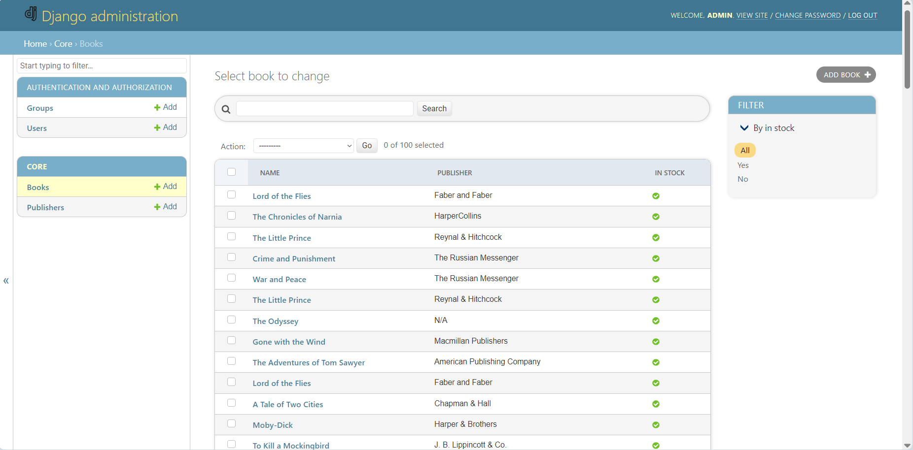
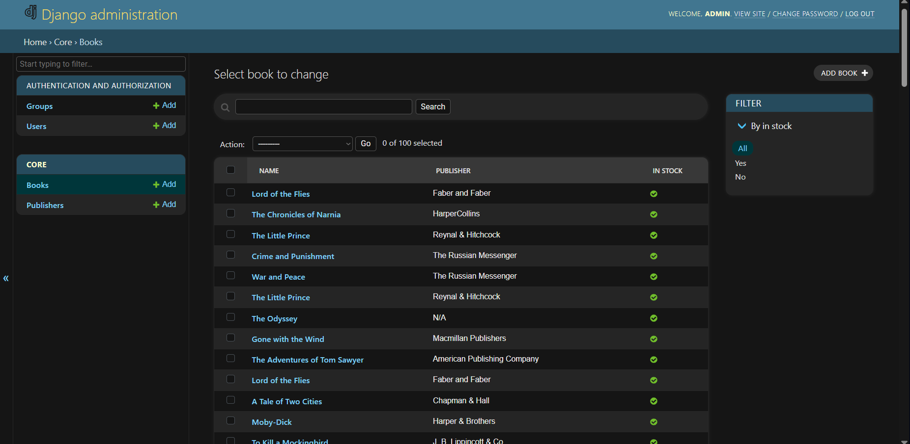
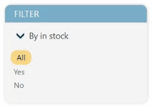
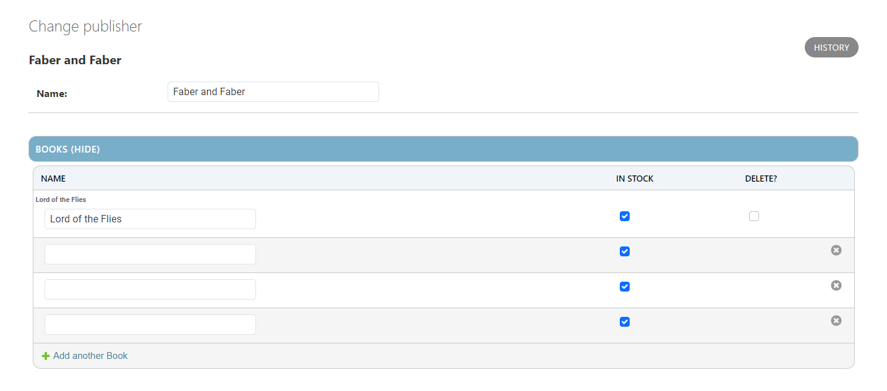
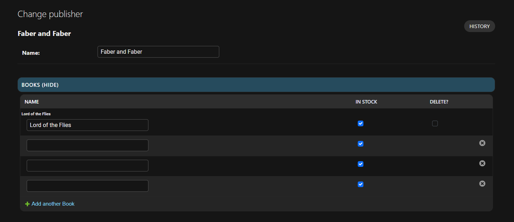
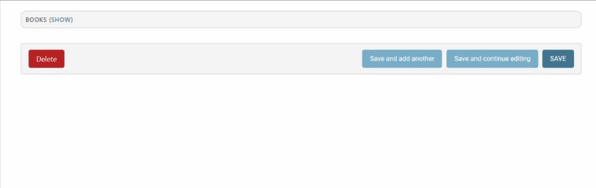

# DjangoUI Enhancer

DjangoUI Enhancer is a collection of styles designed to elevate and improve the user interface (UI) of your Django applications. With a focus on enhancing functionality and aesthetics, DjangoUI Enhancer empowers you to create visually appealing and professional user interfaces.

## Key Features:

1. Sophisticated Design: DjangoUI Enhancer provides an array of visually appealing components and carefully curated color schemes, enabling you to create attractive and polished user interfaces.
2. Flexible Customization: Effortlessly adapt styles and visual elements to align with your specific needs, seamlessly integrating with your existing Django projects.
3. Full Compatibility with Django: DjangoUI Enhancer is meticulously designed to seamlessly integrate with native Django functionality, ensuring a seamless and cohesive user experience.

## Compiling SCSS to CSS

To compile SCSS code into CSS, follow these steps:

1. **Install Sass:** Make sure you have Sass installed on your system. Sass is a CSS preprocessor that allows you to write styles using SCSS syntax. Refer to the official Sass documentation for installation instructions.

2. **Create SCSS File:** Create an SCSS file where you'll write your styles using Sass syntax.

3. **Compile SCSS to CSS:** Open a terminal or command prompt, navigate to the location of your SCSS file, and run the following command to compile SCSS to CSS:

    ```bash
    sass input.scss output.css
    ```
## Overriding Templates for Custom CSS Styling:

To use the CSS styles provided by DjangoUI Enhancer, you need to override the templates as follows:

1. **base.html or base_site.html:**

    ```django
    
    

    
    {{ block.super }}
    <link rel="stylesheet" href="">
    
        <link rel="stylesheet" href="">
    
    <link rel="stylesheet" href="">
    
    ```

2. **change_form.html (only needed if using Django M2M Widget):**

    ```django
    
    

    
    {{ block.super }}
    <link rel="stylesheet" href="">
    
    ```

3. **change_list.html**

    ```django
    
    

    
    {{ block.super }}
    <link rel="stylesheet" href="">
    
    ```

## Screenshots

1. Change List Light
    
2. Change List Dark
    
3. Change list Chevron (Changed Django arrows to chevrons and added a rotating animation)
    
4. SideBar (Added animation for button arrow and content expansion)
    
5. Change Form Light
    
6. Change Form Dark
    
7. Change Form Inline (Added animation for the background color change of the collapser and the display of forms)
    
